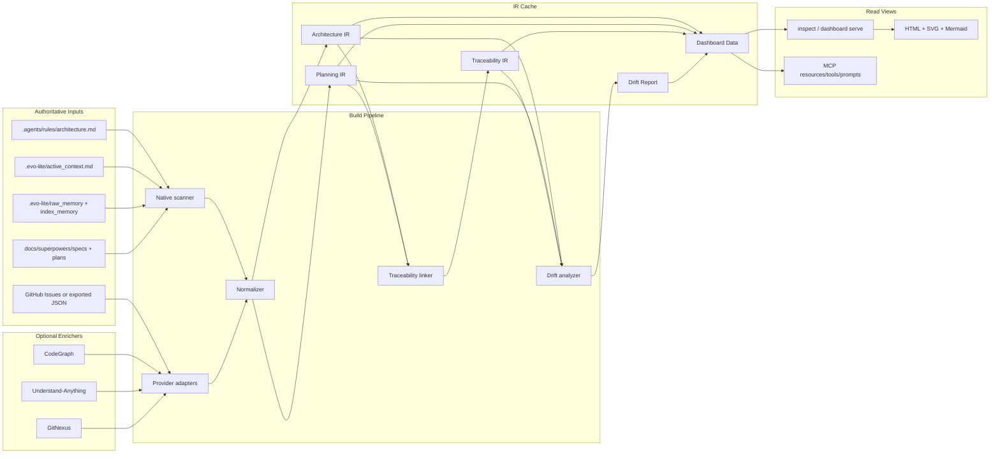
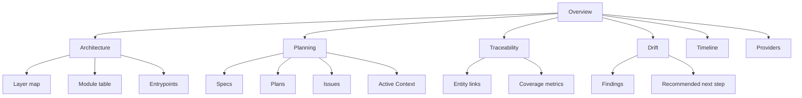
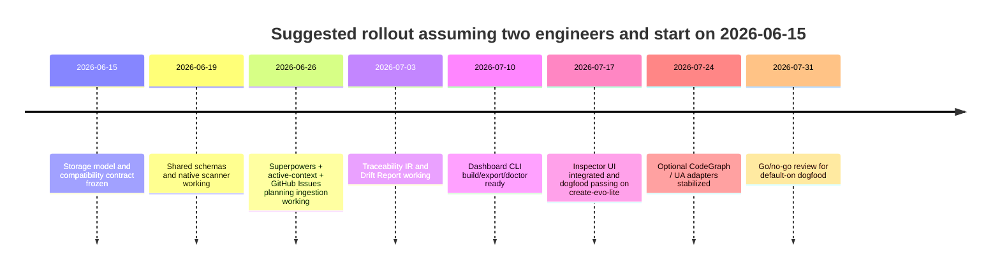

# Evo-Lite Project Control Dashboard Specification

## Executive Summary

This specification recommends extending the existing Evo-Lite `inspect` surface into a read-only **Project Control Dashboard** rather than creating a parallel control plane. That recommendation is grounded in the present repository shape: Evo-Lite already treats `.agents/` and `.evo-lite/` as the canonical semantics/runtime layer, while `AGENTS.md`, `CLAUDE.md`, and other host-facing files are generated adapters; it already maintains explicit runtime state in `active_context.md`, durable archive/index paths under `.evo-lite/`, a `verify` flow, and a minimal loopback inspector that intentionally reuses `memory.service` instead of inventing a second source of truth. The repository also already contains Superpowers-style planning artifacts under `docs/superpowers/specs` and `docs/superpowers/plans`, which makes planning/progress ingestion a first-class fit rather than an afterthought. citeturn16view3turn17view3turn37view0turn35view0turn35view1turn35view2turn36view0turn36view1

The core design choice is a **canonical intermediate representation pipeline**: optional providers such as CodeGraph, Understand-Anything, GitNexus, GitHub Issues, and Superpowers contribute data only through adapters, and all outputs normalize into five internal contracts: **Architecture IR**, **Planning IR**, **Traceability IR**, **Drift Report**, and **Dashboard Data**. This ensures the dashboard still works when no external tool is installed, while allowing richer graph/process/impact views when tools are present. That architecture also matches current Evo-Lite philosophy: project-local, durable, auditable, and governed, rather than a standalone cloud memory service. citeturn15view0turn16view3turn21view3turn28view2turn21view2turn21view0

The recommended delivery path is phased. **MVP** should ship native scanning plus Superpowers plan/spec parsing, existing Evo-Lite runtime/verify/archive ingestion, GitHub Issues import, traceability linking, and a loopback HTML dashboard. **P2/P3** should add CodeGraph, Understand-Anything, and GitNexus as optional enrichers rather than hard dependencies. This ordering is important because the repository currently has a low-dependency CLI posture—with `commander` as the package dependency and a zero-dependency HTTP inspector—and most of `.evo-lite/*` is ignored by default unless explicitly whitelisted or served from the CLI tree. citeturn43view0turn37view0turn6view4

A second major conclusion is that the dashboard must represent **not only current code state, but also target architecture, plans, and implementation progress**. That is not hypothetical: the current repo already stores superpowers-generated design and implementation plan files, and existing Evo-Lite governance rules already distinguish between the durable path (`active_context -> context track -> archive`), lightweight recall, and architecture lock-in. A control dashboard that ignored plan/spec inputs would miss exactly the information this repository already values. citeturn36view0turn36view1turn17view3turn12view1

One operational note: the enabled connector target for this request is **GitHub**. In this session, direct GitHub connector actions were not exposed through `api_tool`, so grounding used public GitHub source pages and official GitHub docs. The design below therefore includes a **connector-first GitHub adapter contract** with REST/file-export fallbacks, so the implementation works both with and without a live GitHub connector.

## Evidence and Current State

### Repository Reality That Shapes the Design

Evo-Lite’s own README defines the product as a **daemonless, project-local governance runtime**, not just a memory layer. It explicitly says the canonical truth lives in `.agents/` and `.evo-lite/`, while root-level `AGENTS.md` and `CLAUDE.md` are host adapters that may be regenerated. That means a dashboard must privilege the canonical rule/runtime tree and treat host-facing files as secondary views, not primary planning or architecture sources. citeturn15view0turn16view3

The repository already exposes an internal notion of operational health and closure. The README describes `active_context.md` as the cockpit, `archive`/`track` as the durable chain, and `remember` as a lightweight recall path; `verify` checks index health, memory runtime state, context freshness, and whether the workspace is safe to hand over. The `/commit` fast path is already expected to turn code change, context tracking, and runtime state into a structured closure flow. A project-control dashboard should therefore elevate these existing governance signals rather than invent a separate workflow tracker. citeturn17view3turn13view0

The repository also already validates governance structure inside `active_context.md`. The validation path checks required anchors, requires a non-empty `FOCUS`, raises an error when the active backlog exceeds five unchecked items, and warns when trajectory entries exceed twenty. These are exactly the kinds of “control plane” signals that belong on the dashboard summary view. citeturn12view3turn9view10turn9view9

Architecture lock-in is already a first-class concern. The current `architecture.md` template is still placeholder-driven, and `memory.service.js` already classifies architecture state as `missing`, `placeholder`, or `configured` by checking the rules file for placeholder markers. The dashboard should therefore show **architecture status** explicitly and refuse to present inferred system diagrams as if they were locked architecture when the architecture rules file is still placeholder text. citeturn6view0turn12view1

Most importantly for implementation strategy, the current inspector already exists and already encodes the right philosophy. Its source comment says it is a **local inspector (P4)**, loopback only, zero dependency, with bundled static HTML, and that it should reuse `memory.service` public APIs rather than introduce a second read-only source of truth. It currently exposes `/api/timeline`, `/api/archive`, and `/api/verify`, and `buildVerifyJson()` already returns active engine, namespaces, archive health, and safety state. The correct dashboard strategy is therefore to **extend this inspector** with `/api/control/*` endpoints and richer HTML, not replace it. citeturn37view0

Planning/progress inputs also already exist in-repo. `docs/superpowers/` contains both `plans/` and `specs/`, and those folders already include a real spec/plan pair for the Evo recall-first takeover work. The plan file explicitly identifies itself as a Superpowers-driven implementation plan and points back to the spec; the spec describes goals, architecture impacts, contracts, testing, and milestones. This is more than enough basis for a Planning IR parser. citeturn35view0turn35view1turn35view2turn36view0turn36view1

Finally, template and upgrade constraints matter. `create-evo-lite` currently has a minimal dependency surface (`commander`), its template system already manages `inspector.js` in the `core-cli` family, and `.gitignore` ignores most of `.evo-lite/*` except selected runtime assets such as `active_context.md`, `cli/`, and archive/index paths. That means any dashboard implementation must be careful about where it writes derived data and must update template manifest/sync paths if new runtime files are introduced. citeturn43view0turn6view3turn6view4

### External Tool Comparison

The external tools are useful, but they have very different strengths, transport models, and licensing implications. The right architecture is therefore **adapter-based and optional**, not provider-dependent.

| Tool | License | Local-first | MCP support | Consumable outputs | Maturity assessment | Integration effort | Recommended role | Evidence |
|---|---|---:|---:|---|---|---|---|---|
| CodeGraph | MIT | Yes | Yes | `.codegraph/`, local SQLite graph, CLI JSON, MCP tools (`explore`, `search`, `callers`, `callees`, `impact`, `node`, `status`) | High | Medium | Symbol graph, call graph, impact, affected tests | README/license show `.codegraph/`, local SQLite, MCP tools, and MIT. citeturn41view0turn41view1turn41view3turn41view4turn41view5turn25view0 |
| Understand-Anything | MIT | Yes | Not documented as a standalone MCP server; plugin/command workflow | `.understand-anything/knowledge-graph.json`, dashboard UI, layer/domain annotations, diff/onboarding flows | Medium-High | Medium | Teaching graph, layer/domain visualization, onboarding explanations | README/license show knowledge graph output, dashboard, layer visualization, domain view, and MIT. citeturn28view2turn20view5turn20view8turn28view3turn28view5turn25view1 |
| GitNexus | PolyForm Noncommercial 1.0.0 | Yes | Yes | MCP tools/resources/prompts, local `.gitnexus/` index, browser UI, clusters/processes/impact | Medium | Medium-High | Multi-repo process graph, process-grouped search, impact mapping | README/license show noncommercial license, MCP tools/resources/prompts, global registry, local/browser execution, and process-centric outputs. citeturn24view0turn21view2turn20view9turn20view10turn20view11turn25view5turn29view0turn29view2turn29view3turn29view6 |
| GitHub Issues | Service/API | Remote by default, local if exported | Via external GitHub MCP servers or direct API; official docs center on REST/GraphQL APIs | JSON issues, labels, milestones, comments, events | Very High | Low | Execution/progress truth, delivery status, event timeline | GitHub docs show repository issues and issue events endpoints, methods, headers, path, and pagination. citeturn30view0turn30view1turn30view2 |
| Superpowers | MIT | Yes | No standalone MCP server implied; agent/plugin methodology | Markdown specs, plans, tasks, methodology prompts/skills | High | Low | Intent/spec/plan truth, acceptance criteria, delivery decomposition | README/license show methodology, spec-first/plan-first workflow, TDD emphasis, and MIT. citeturn21view0turn25view2turn25view9turn25view10 |

The implication is straightforward. **MVP should not depend on CodeGraph, Understand-Anything, or GitNexus.** It should work with native scanning plus repo-authored artifacts. Among externals, **GitHub Issues** and **Superpowers** are the highest-value early integrations because they provide progress/intent rather than another inferred code graph. CodeGraph, Understand-Anything, and GitNexus should then be layered in as optional enrichers for architecture/process visualization. GitNexus in particular must remain **opt-in** until licensing is reviewed for the intended use context, because its repository is under PolyForm Noncommercial rather than MIT. citeturn24view0turn21view2turn21view0

### Why the Spec Uses Context-Grounded, Spec-Driven Controls

The design below intentionally treats planning, architecture, and code evidence as separate but linked artifacts. That is consistent with recent work on **context-grounded agentic workflows**, which found that repository-evidence hooks and validation hooks improved judged output quality while keeping test compatibility high, and with specification-driven development work that emphasizes keeping abstract design, implementation, and verification tightly connected through continuous validation. Those findings strongly support a dashboard that tracks not only what code exists, but also how code maps back to specs, plans, and verification evidence. citeturn39view0turn40view0

## Product Specification

### Background and Goals

The Project Control Dashboard is a **read-only control surface for Evo-Lite workspaces**. It is not a replacement for `active_context`, `archive`, `verify`, specs, plans, or provider-native dashboards. Its purpose is to make the current project state legible in one place by combining:

1. **Architecture state**: what the system is, how it is structured, and whether architecture is actually locked.
2. **Planning state**: what the project intends to build, how far along it is, and where work is blocked.
3. **Traceability state**: which code, tests, issues, plans, specs, and archive items support which decisions.
4. **Drift state**: where current implementation diverges from intended architecture or declared plans.
5. **Runtime health**: verify/archive/active-context/safety signals already produced by Evo-Lite.

The dashboard must satisfy six design goals.

First, it must honor **Evo-Lite’s single-source-of-truth discipline**. Existing read APIs and repo-authored files remain authoritative; the dashboard is only a compiled view, never the place where truth is edited. This follows the current inspector’s “no second source of truth” stance and the repository’s canonical semantics model. citeturn37view0turn16view3

Second, it must be **local-first and degrade gracefully**. If CodeGraph, Understand-Anything, GitNexus, GitHub Issues auth, or the GitHub connector are unavailable, the dashboard must still surface useful structure using native scanning plus repo-authored material. That requirement follows directly from the repository’s daemonless, project-local nature. citeturn15view0turn16view3

Third, it must surface **current state and intended state together**. Because this repo already has Superpowers specs/plans and formal architecture rules, the dashboard is incomplete unless it can show architecture/plan/progress in the same place as code/runtime health. citeturn35view1turn35view2turn36view0turn36view1

Fourth, it must be **read-only over HTTP and explicit over transports**. The inspector should remain loopback-only. Remote APIs such as GitHub Issues should be used only by CLI/adapters, never by browser code directly. Tokens remain server-side; browser code receives normalized dashboard JSON only. This keeps the current loopback security model intact and aligns with MCP’s user-consent and trust-and-safety expectations. citeturn37view0turn31view0turn31view3

Fifth, it must respect the repository’s **minimal runtime footprint**. The current package and inspector design argue against React/Vite-style app scaffolding for MVP. The correct MVP is static HTML/CSS/vanilla JS served by the existing loopback server, with optional vendored Mermaid/P2 assets if needed. citeturn43view0turn37view0

Sixth, it must be **template-aware**. Because `create-evo-lite` is itself a scaffold/upgrader, any new dashboard files or schemas added under `templates/` have to be reflected in manifest/sync behavior, and any persisted caches under `.evo-lite/` must either stay derived/ignored or be explicitly whitelisted. citeturn6view3turn6view4

### Scope

The recommended scope is phased as follows.

| Phase | In scope | Out of scope |
|---|---|---|
| MVP | Native scanner; Superpowers spec/plan parser; existing Evo-Lite runtime/verify/archive ingestion; optional GitHub Issues import; IR generation; drift engine; loopback HTML dashboard; JSON export; Markdown export; compatibility with existing `inspect` endpoints | No write-back to issues/plans; no background daemon; no provider-required features; no browser-side secrets; no live collaboration |
| P1 | Coverage metrics; richer traceability matrix; exportable Mermaid source; SVG export; compatibility tests; template manifest integration; docs and dogfood CI | No semantic code mutation; no automatic remediation; no dependency on external CDNs |
| P2 | CodeGraph adapter; Understand-Anything adapter; provider freshness/status pane; confidence and provenance overlays | No provider lock-in; no requirement that providers be installed |
| P3 | GitNexus adapter; multi-repo/process lens; process-centric impact overlays; cross-repo traceability | No commercial deployment path using GitNexus until license/legal review passes |
| P4 | Optional bundled Mermaid renderer; richer interactive drilldown; cached snapshots in docs; optional subscriptions/SSE for local refresh | No mandatory always-on service; no cloud sync |

### Explicit Non-Goals

This dashboard should not become a replacement for current Evo-Lite workflows. It does not replace `/commit`, `/mem`, `/wash`, `verify`, or `active_context`. It does not create a new state editor, new durable planning source, or new memory substrate.

It also does not promise perfect semantic architecture inference from code alone. If `.agents/rules/architecture.md` is missing or placeholder text, the dashboard should say so clearly and present inferred graphs as **observed structure**, not **locked architecture**. citeturn12view1

### Recommended Repository Layout

The implementation should separate **authoritative inputs**, **derived cache**, and **optional exported snapshots**.

```text
docs/specs/project-control-dashboard.md              # This spec
docs/project-control/                               # Optional explicit exports only
  snapshots/
  architecture.mmd
  dashboard-summary.md

templates/cli/
  inspector.js                                      # Extended, backward-compatible
  control.service.js                                # IR build + cache orchestration
  control.drift.js                                  # Drift analyzer
  control.traceability.js                           # Linker
  control.native-scanner.js                         # Native scanner
  adapters/
    superpowers.adapter.js
    github-issues.adapter.js
    codegraph.adapter.js
    understand-anything.adapter.js
    gitnexus.adapter.js
  schemas/
    shared.schema.json
    architecture-ir.schema.json
    planning-ir.schema.json
    traceability-ir.schema.json
    drift-report.schema.json
    dashboard-data.schema.json
  static/
    dashboard.html
    dashboard.css
    dashboard.js
    vendor/                                         # Optional P2 vendored Mermaid
```

The derived cache should live at:

```text
.evo-lite/control/cache/
  architecture.ir.json
  planning.ir.json
  traceability.ir.json
  drift-report.json
  dashboard-data.json
  provider-status.json
```

That cache should remain **derived and ignored** by default. If snapshot files are meant to be versioned, they should be exported into `docs/project-control/`, not committed implicitly under `.evo-lite/`. This keeps the current `.gitignore` model sane. citeturn6view4

### Data-Flow Overview



### Assumptions and Unspecified Operational Inputs

Several practical inputs were not specified in the request. The spec therefore adopts safe defaults and provides options.

| Item | Status | Default in this spec | Options |
|---|---|---|---|
| Team size | Unspecified | 2 engineers + 0.25 docs/QA for timeline estimate | Solo-maintainer path also provided |
| CI environment | Unspecified | Local Node tests first; optional GitHub Actions | GitHub Actions, local-only, or pre-commit |
| GitHub auth mode | Unspecified | Connector-first, then `GITHUB_TOKEN`, then file export | PAT, GitHub App, repo export JSON |
| Browser/offline requirement | Unspecified | Offline-first/read-only inspector | Optional bundled Mermaid in later phase |
| Commercial use with GitNexus | Unspecified | Treat GitNexus as disabled by default pending legal check | Enable only in noncommercial/dogfood contexts |
| Language breadth for native parsing | Unspecified | Architecture-lite native scanner, richer language support via providers | Add language packs later if warranted |

## Data Contracts and Interfaces

### Canonical Source Classes and Precedence

The dashboard should merge evidence using the following precedence.

1. **Authoritative manual artifacts**: `.agents/rules/architecture.md`, `docs/superpowers/specs`, `docs/superpowers/plans`, GitHub Issue state, `active_context.md`.
2. **Observed local runtime/code artifacts**: file tree, imports, package manifests, archive/index state, `verify` output.
3. **Inferred provider outputs**: CodeGraph, Understand-Anything, GitNexus.

Conflict policy should be conservative:

- Repo-authored architecture docs outrank inferred provider layer labels.
- Code existence outranks issue text for “what is implemented”.
- `active_context` outranks archival memory for “what is current now”.
- Provider disagreement is surfaced as **provider drift**, not silently merged away.

That policy keeps the dashboard aligned with the repository’s canonical semantics model and with the inspector’s no-second-source design. citeturn16view3turn37view0

### Shared JSON Schema Definitions

Recommended file: `templates/cli/schemas/shared.schema.json`

```json
{
  "$schema": "https://json-schema.org/draft/2020-12/schema",
  "$id": "https://evo-lite.dev/schemas/project-control/shared.schema.json",
  "$defs": {
    "sourceRef": {
      "type": "object",
      "required": ["provider", "kind"],
      "properties": {
        "provider": { "type": "string" },
        "kind": { "type": "string" },
        "uri": { "type": "string" },
        "path": { "type": "string" },
        "externalId": { "type": "string" },
        "lineStart": { "type": "integer", "minimum": 1 },
        "lineEnd": { "type": "integer", "minimum": 1 },
        "confidence": { "type": "number", "minimum": 0, "maximum": 1 },
        "capturedAt": { "type": "string", "format": "date-time" }
      },
      "additionalProperties": false
    },
    "progress": {
      "type": "object",
      "required": ["percent"],
      "properties": {
        "percent": { "type": "number", "minimum": 0, "maximum": 100 },
        "completed": { "type": "integer", "minimum": 0 },
        "total": { "type": "integer", "minimum": 0 }
      },
      "additionalProperties": false
    },
    "severity": {
      "type": "string",
      "enum": ["info", "low", "medium", "high", "critical"]
    }
  }
}
```

### Architecture IR

Recommended file: `templates/cli/schemas/architecture-ir.schema.json`

```json
{
  "$schema": "https://json-schema.org/draft/2020-12/schema",
  "$id": "https://evo-lite.dev/schemas/project-control/architecture-ir.schema.json",
  "title": "Architecture IR",
  "type": "object",
  "required": ["irVersion", "repo", "generatedAt", "status", "sources", "nodes", "edges"],
  "properties": {
    "irVersion": { "const": "1.0" },
    "repo": {
      "type": "object",
      "required": ["name", "root"],
      "properties": {
        "name": { "type": "string" },
        "root": { "type": "string" },
        "defaultBranch": { "type": "string" },
        "commit": { "type": ["string", "null"] }
      },
      "additionalProperties": false
    },
    "generatedAt": { "type": "string", "format": "date-time" },
    "status": { "type": "string", "enum": ["configured", "placeholder", "missing", "partial"] },
    "sources": {
      "type": "array",
      "items": { "$ref": "./shared.schema.json#/$defs/sourceRef" }
    },
    "nodes": {
      "type": "array",
      "items": {
        "type": "object",
        "required": ["id", "kind", "name"],
        "properties": {
          "id": { "type": "string" },
          "kind": { "type": "string", "enum": ["repo", "package", "module", "file", "symbol", "service", "workflow", "domain", "doc"] },
          "name": { "type": "string" },
          "path": { "type": "string" },
          "layer": { "type": "string" },
          "lang": { "type": "string" },
          "description": { "type": "string" },
          "provider": { "type": "string" },
          "confidence": { "type": "number", "minimum": 0, "maximum": 1 },
          "tags": { "type": "array", "items": { "type": "string" } },
          "metrics": {
            "type": "object",
            "properties": {
              "loc": { "type": "integer", "minimum": 0 },
              "fanIn": { "type": "integer", "minimum": 0 },
              "fanOut": { "type": "integer", "minimum": 0 }
            },
            "additionalProperties": false
          }
        },
        "additionalProperties": false
      }
    },
    "edges": {
      "type": "array",
      "items": {
        "type": "object",
        "required": ["id", "kind", "from", "to"],
        "properties": {
          "id": { "type": "string" },
          "kind": { "type": "string", "enum": ["contains", "imports", "calls", "depends_on", "defines", "implements", "constrained_by", "maps_to_domain"] },
          "from": { "type": "string" },
          "to": { "type": "string" },
          "confidence": { "type": "number", "minimum": 0, "maximum": 1 },
          "sources": {
            "type": "array",
            "items": { "$ref": "./shared.schema.json#/$defs/sourceRef" }
          }
        },
        "additionalProperties": false
      }
    },
    "views": {
      "type": "object",
      "properties": {
        "layers": { "type": "array", "items": { "type": "string" } },
        "entrypoints": { "type": "array", "items": { "type": "string" } },
        "criticalPaths": { "type": "array", "items": { "type": "array", "items": { "type": "string" } } }
      },
      "additionalProperties": false
    },
    "warnings": { "type": "array", "items": { "type": "string" } }
  },
  "additionalProperties": false
}
```

Example instance:

```json
{
  "irVersion": "1.0",
  "repo": {
    "name": "create-evo-lite",
    "root": ".",
    "defaultBranch": "main"
  },
  "generatedAt": "2026-06-11T18:00:00Z",
  "status": "placeholder",
  "sources": [
    {
      "provider": "native-scanner",
      "kind": "architecture-rules",
      "path": ".agents/rules/architecture.md",
      "confidence": 1
    }
  ],
  "nodes": [
    {
      "id": "repo:create-evo-lite",
      "kind": "repo",
      "name": "create-evo-lite",
      "provider": "native-scanner",
      "confidence": 1
    },
    {
      "id": "module:templates/cli/inspector.js",
      "kind": "module",
      "name": "inspector.js",
      "path": "templates/cli/inspector.js",
      "layer": "runtime",
      "lang": "js",
      "provider": "native-scanner",
      "confidence": 0.95
    },
    {
      "id": "doc:.agents/rules/architecture.md",
      "kind": "doc",
      "name": "architecture.md",
      "path": ".agents/rules/architecture.md",
      "layer": "governance",
      "provider": "native-scanner",
      "confidence": 1
    }
  ],
  "edges": [
    {
      "id": "edge:contains:repo->inspector",
      "kind": "contains",
      "from": "repo:create-evo-lite",
      "to": "module:templates/cli/inspector.js",
      "confidence": 1
    },
    {
      "id": "edge:constrained_by:inspector->architecture",
      "kind": "constrained_by",
      "from": "module:templates/cli/inspector.js",
      "to": "doc:.agents/rules/architecture.md",
      "confidence": 0.7
    }
  ],
  "views": {
    "layers": ["governance", "runtime"]
  },
  "warnings": [
    "architecture.md still contains placeholder markers"
  ]
}
```

### Planning IR

Recommended file: `templates/cli/schemas/planning-ir.schema.json`

```json
{
  "$schema": "https://json-schema.org/draft/2020-12/schema",
  "$id": "https://evo-lite.dev/schemas/project-control/planning-ir.schema.json",
  "title": "Planning IR",
  "type": "object",
  "required": ["irVersion", "generatedAt", "items"],
  "properties": {
    "irVersion": { "const": "1.0" },
    "generatedAt": { "type": "string", "format": "date-time" },
    "items": {
      "type": "array",
      "items": {
        "type": "object",
        "required": ["id", "kind", "title", "status", "source"],
        "properties": {
          "id": { "type": "string" },
          "kind": { "type": "string", "enum": ["objective", "spec", "plan", "epic", "issue", "task", "risk", "milestone", "active-context-task"] },
          "title": { "type": "string" },
          "status": { "type": "string", "enum": ["proposed", "planned", "in-progress", "blocked", "done", "cancelled", "unknown"] },
          "priority": { "type": "string", "enum": ["p0", "p1", "p2", "p3", "p4", "unknown"] },
          "progress": { "$ref": "./shared.schema.json#/$defs/progress" },
          "parentIds": { "type": "array", "items": { "type": "string" } },
          "dependsOn": { "type": "array", "items": { "type": "string" } },
          "owner": { "type": "string" },
          "labels": { "type": "array", "items": { "type": "string" } },
          "estimate": { "type": "string" },
          "acceptance": { "type": "array", "items": { "type": "string" } },
          "source": { "$ref": "./shared.schema.json#/$defs/sourceRef" }
        },
        "additionalProperties": false
      }
    },
    "milestones": {
      "type": "array",
      "items": {
        "type": "object",
        "required": ["id", "title"],
        "properties": {
          "id": { "type": "string" },
          "title": { "type": "string" },
          "targetDate": { "type": "string", "format": "date" }
        },
        "additionalProperties": false
      }
    },
    "summary": {
      "type": "object",
      "properties": {
        "totalItems": { "type": "integer", "minimum": 0 },
        "doneItems": { "type": "integer", "minimum": 0 },
        "blockedItems": { "type": "integer", "minimum": 0 }
      },
      "additionalProperties": false
    }
  },
  "additionalProperties": false
}
```

Example instance:

```json
{
  "irVersion": "1.0",
  "generatedAt": "2026-06-11T18:00:00Z",
  "items": [
    {
      "id": "spec:2026-05-14-recall-first-takeover-design",
      "kind": "spec",
      "title": "Evo Recall-First Takeover Design",
      "status": "planned",
      "priority": "p1",
      "source": {
        "provider": "superpowers",
        "kind": "spec-markdown",
        "path": "docs/superpowers/specs/2026-05-14-evo-recall-first-takeover-design.md",
        "confidence": 1
      }
    },
    {
      "id": "plan:2026-05-14-recall-first-takeover",
      "kind": "plan",
      "title": "Evo Recall-First Takeover Implementation Plan",
      "status": "in-progress",
      "priority": "p1",
      "parentIds": ["spec:2026-05-14-recall-first-takeover-design"],
      "source": {
        "provider": "superpowers",
        "kind": "plan-markdown",
        "path": "docs/superpowers/plans/2026-05-14-evo-recall-first-takeover.md",
        "confidence": 1
      }
    },
    {
      "id": "task:active-context:tighten-upgrade-notes",
      "kind": "active-context-task",
      "title": "Tighten the upgrade notes in README",
      "status": "planned",
      "priority": "p2",
      "source": {
        "provider": "native-scanner",
        "kind": "active-context",
        "path": ".evo-lite/active_context.md",
        "confidence": 0.9
      }
    }
  ],
  "summary": {
    "totalItems": 3,
    "doneItems": 0,
    "blockedItems": 0
  }
}
```

### Traceability IR

Recommended file: `templates/cli/schemas/traceability-ir.schema.json`

```json
{
  "$schema": "https://json-schema.org/draft/2020-12/schema",
  "$id": "https://evo-lite.dev/schemas/project-control/traceability-ir.schema.json",
  "title": "Traceability IR",
  "type": "object",
  "required": ["irVersion", "generatedAt", "entities", "relations"],
  "properties": {
    "irVersion": { "const": "1.0" },
    "generatedAt": { "type": "string", "format": "date-time" },
    "entities": {
      "type": "array",
      "items": {
        "type": "object",
        "required": ["id", "kind", "label"],
        "properties": {
          "id": { "type": "string" },
          "kind": { "type": "string", "enum": ["spec", "plan", "issue", "task", "architecture-node", "code-file", "symbol", "test", "archive", "active-context", "provider-finding"] },
          "label": { "type": "string" },
          "path": { "type": "string" }
        },
        "additionalProperties": false
      }
    },
    "relations": {
      "type": "array",
      "items": {
        "type": "object",
        "required": ["id", "kind", "from", "to"],
        "properties": {
          "id": { "type": "string" },
          "kind": { "type": "string", "enum": ["implements", "planned_by", "specified_by", "verified_by", "mentioned_in", "blocks", "resolved_by", "generated_from", "drifts_from"] },
          "from": { "type": "string" },
          "to": { "type": "string" },
          "sources": {
            "type": "array",
            "items": { "$ref": "./shared.schema.json#/$defs/sourceRef" }
          }
        },
        "additionalProperties": false
      }
    },
    "coverage": {
      "type": "object",
      "properties": {
        "planningItemsWithCodeLinks": { "type": "integer", "minimum": 0 },
        "planningItemsWithTestLinks": { "type": "integer", "minimum": 0 },
        "planningItemsWithoutAnyLinks": { "type": "integer", "minimum": 0 }
      },
      "additionalProperties": false
    }
  },
  "additionalProperties": false
}
```

Example instance:

```json
{
  "irVersion": "1.0",
  "generatedAt": "2026-06-11T18:00:00Z",
  "entities": [
    {
      "id": "spec:2026-05-14-recall-first-takeover-design",
      "kind": "spec",
      "label": "Evo Recall-First Takeover Design",
      "path": "docs/superpowers/specs/2026-05-14-evo-recall-first-takeover-design.md"
    },
    {
      "id": "plan:2026-05-14-recall-first-takeover",
      "kind": "plan",
      "label": "Evo Recall-First Takeover Implementation Plan",
      "path": "docs/superpowers/plans/2026-05-14-evo-recall-first-takeover.md"
    },
    {
      "id": "file:templates/cli/memory.service.js",
      "kind": "code-file",
      "label": "templates/cli/memory.service.js",
      "path": "templates/cli/memory.service.js"
    },
    {
      "id": "file:templates/cli/memory.js",
      "kind": "code-file",
      "label": "templates/cli/memory.js",
      "path": "templates/cli/memory.js"
    }
  ],
  "relations": [
    {
      "id": "rel:plan:specified_by:spec",
      "kind": "specified_by",
      "from": "plan:2026-05-14-recall-first-takeover",
      "to": "spec:2026-05-14-recall-first-takeover-design"
    },
    {
      "id": "rel:spec:implements:file1",
      "kind": "implements",
      "from": "spec:2026-05-14-recall-first-takeover-design",
      "to": "file:templates/cli/memory.service.js"
    },
    {
      "id": "rel:spec:implements:file2",
      "kind": "implements",
      "from": "spec:2026-05-14-recall-first-takeover-design",
      "to": "file:templates/cli/memory.js"
    }
  ],
  "coverage": {
    "planningItemsWithCodeLinks": 1,
    "planningItemsWithTestLinks": 0,
    "planningItemsWithoutAnyLinks": 0
  }
}
```

### Drift Report

Recommended file: `templates/cli/schemas/drift-report.schema.json`

```json
{
  "$schema": "https://json-schema.org/draft/2020-12/schema",
  "$id": "https://evo-lite.dev/schemas/project-control/drift-report.schema.json",
  "title": "Drift Report",
  "type": "object",
  "required": ["irVersion", "generatedAt", "summary", "findings"],
  "properties": {
    "irVersion": { "const": "1.0" },
    "generatedAt": { "type": "string", "format": "date-time" },
    "summary": {
      "type": "object",
      "required": ["countsBySeverity"],
      "properties": {
        "countsBySeverity": {
          "type": "object",
          "properties": {
            "info": { "type": "integer", "minimum": 0 },
            "low": { "type": "integer", "minimum": 0 },
            "medium": { "type": "integer", "minimum": 0 },
            "high": { "type": "integer", "minimum": 0 },
            "critical": { "type": "integer", "minimum": 0 }
          },
          "additionalProperties": false
        }
      },
      "additionalProperties": false
    },
    "findings": {
      "type": "array",
      "items": {
        "type": "object",
        "required": ["id", "category", "severity", "title", "recommendation"],
        "properties": {
          "id": { "type": "string" },
          "category": { "type": "string", "enum": ["architecture", "planning", "traceability", "provider", "freshness", "governance"] },
          "severity": { "$ref": "./shared.schema.json#/$defs/severity" },
          "title": { "type": "string" },
          "expected": { "type": "array", "items": { "type": "string" } },
          "actual": { "type": "array", "items": { "type": "string" } },
          "recommendation": { "type": "string" },
          "sources": {
            "type": "array",
            "items": { "$ref": "./shared.schema.json#/$defs/sourceRef" }
          }
        },
        "additionalProperties": false
      }
    }
  },
  "additionalProperties": false
}
```

Example instance:

```json
{
  "irVersion": "1.0",
  "generatedAt": "2026-06-11T18:00:00Z",
  "summary": {
    "countsBySeverity": {
      "info": 0,
      "low": 0,
      "medium": 1,
      "high": 1,
      "critical": 0
    }
  },
  "findings": [
    {
      "id": "drift:architecture-placeholder",
      "category": "architecture",
      "severity": "high",
      "title": "Architecture rules are still placeholder text",
      "expected": [
        "Configured architecture decisions in .agents/rules/architecture.md"
      ],
      "actual": [
        "Placeholder markers still present"
      ],
      "recommendation": "Lock architecture before treating inferred diagrams as normative"
    },
    {
      "id": "drift:plan-no-issues",
      "category": "planning",
      "severity": "medium",
      "title": "Superpowers plan has no linked GitHub issues",
      "expected": [
        "At least one issue/epic linked to major implementation plan"
      ],
      "actual": [
        "No issue linkage found"
      ],
      "recommendation": "Create or import issue epics for plan tracking"
    }
  ]
}
```

### Dashboard Data

Recommended file: `templates/cli/schemas/dashboard-data.schema.json`

```json
{
  "$schema": "https://json-schema.org/draft/2020-12/schema",
  "$id": "https://evo-lite.dev/schemas/project-control/dashboard-data.schema.json",
  "title": "Dashboard Data",
  "type": "object",
  "required": ["irVersion", "generatedAt", "summaryCards", "panels"],
  "properties": {
    "irVersion": { "const": "1.0" },
    "generatedAt": { "type": "string", "format": "date-time" },
    "summaryCards": {
      "type": "array",
      "items": {
        "type": "object",
        "required": ["id", "title", "status", "value"],
        "properties": {
          "id": { "type": "string" },
          "title": { "type": "string" },
          "status": { "type": "string" },
          "value": {},
          "severity": { "$ref": "./shared.schema.json#/$defs/severity" }
        },
        "additionalProperties": false
      }
    },
    "panels": {
      "type": "object",
      "required": ["architecture", "planning", "traceability", "drift", "verify"],
      "properties": {
        "architecture": {
          "type": "object",
          "properties": {
            "status": { "type": "string" },
            "nodeCount": { "type": "integer", "minimum": 0 },
            "edgeCount": { "type": "integer", "minimum": 0 },
            "mermaid": { "type": "string" }
          },
          "additionalProperties": false
        },
        "planning": {
          "type": "object",
          "properties": {
            "totalItems": { "type": "integer", "minimum": 0 },
            "doneItems": { "type": "integer", "minimum": 0 },
            "blockedItems": { "type": "integer", "minimum": 0 }
          },
          "additionalProperties": false
        },
        "traceability": {
          "type": "object",
          "properties": {
            "coveragePercent": { "type": "number", "minimum": 0, "maximum": 100 }
          },
          "additionalProperties": false
        },
        "drift": {
          "type": "object",
          "properties": {
            "highOrCritical": { "type": "integer", "minimum": 0 }
          },
          "additionalProperties": false
        },
        "verify": {
          "type": "object",
          "properties": {
            "archiveHealth": {},
            "namespaces": {},
            "safety": {}
          },
          "additionalProperties": true
        }
      },
      "additionalProperties": false
    },
    "timeline": {
      "type": "array",
      "items": {
        "type": "object",
        "required": ["label"],
        "properties": {
          "label": { "type": "string" },
          "date": { "type": "string", "format": "date" }
        },
        "additionalProperties": false
      }
    }
  },
  "additionalProperties": false
}
```

Example instance:

```json
{
  "irVersion": "1.0",
  "generatedAt": "2026-06-11T18:00:00Z",
  "summaryCards": [
    {
      "id": "architecture-status",
      "title": "Architecture",
      "status": "placeholder",
      "value": "Not locked",
      "severity": "high"
    },
    {
      "id": "planning",
      "title": "Planning",
      "status": "active",
      "value": {
        "specs": 1,
        "plans": 1,
        "activeItems": 3
      },
      "severity": "info"
    },
    {
      "id": "drift",
      "title": "Drift",
      "status": "needs-attention",
      "value": {
        "highOrCritical": 1
      },
      "severity": "high"
    }
  ],
  "panels": {
    "architecture": {
      "status": "placeholder",
      "nodeCount": 3,
      "edgeCount": 2,
      "mermaid": "flowchart LR\nrepo-->inspector\ninspector-->architecture"
    },
    "planning": {
      "totalItems": 3,
      "doneItems": 0,
      "blockedItems": 0
    },
    "traceability": {
      "coveragePercent": 66.7
    },
    "drift": {
      "highOrCritical": 1
    },
    "verify": {
      "archiveHealth": "healthy",
      "namespaces": {},
      "safety": {
        "blockCount": 0
      }
    }
  },
  "timeline": [
    {
      "label": "2026-05-14 recall-first takeover spec added",
      "date": "2026-05-14"
    }
  ]
}
```

### CLI Contract

The CLI should preserve the current `inspect` command and add a `dashboard` family. `serve` remains read-only; write actions happen only through explicit build/export commands.

| Command | Purpose | Key flags | Output | Side effects |
|---|---|---|---|---|
| `node .evo-lite/cli/memory.js inspect [--port <n>] [--dashboard]` | Backward-compatible loopback UI; `--dashboard` enables new control views during transition | `--port`, `--dashboard`, `--json` | URL on stdout; inspector HTTP server | No repo writes by default |
| `node .evo-lite/cli/memory.js dashboard build` | Build IRs and compiled dashboard cache | `--providers native,superpowers,github-issues,codegraph,ua,gitnexus`, `--offline`, `--issues-owner`, `--issues-repo`, `--issues-file`, `--write-cache`, `--strict` | JSON summary or human-readable report | Optional write to `.evo-lite/control/cache` only |
| `node .evo-lite/cli/memory.js dashboard drift` | Run drift analysis only | `--severity >=medium`, `--json`, `--fail-on high` | DriftReport JSON or text | No writes |
| `node .evo-lite/cli/memory.js dashboard export` | Export Markdown/JSON/Mermaid/SVG snapshots | `--format markdown|json|mermaid|svg`, `--view overview|architecture|planning|traceability|rollout`, `--out <path>` | File(s) under `docs/project-control/` or explicit path | Only writes export targets |
| `node .evo-lite/cli/memory.js dashboard doctor` | Show adapter availability, freshness, license notices, and auth status | `--json` | ProviderStatus report | No writes |

Recommended exit codes:

| Exit code | Meaning |
|---|---|
| `0` | Success |
| `2` | Schema validation failure |
| `3` | Provider unavailable but non-fatal |
| `4` | Drift threshold failure (`--fail-on`) |
| `5` | Auth/config/licensing hard stop |

Sample Markdown export:

```md
# Project Control Dashboard Snapshot

## Summary
- Architecture: placeholder
- Planning items: 3 total, 0 done, 0 blocked
- Traceability coverage: 66.7%
- Drift: 1 high finding

## Highest-priority drift
1. Architecture rules are still placeholder text

## Recommended next step
Lock `.agents/rules/architecture.md` before treating inferred diagrams as normative.
```

### MCP Contract

The MCP surface should be explicitly **read-only** and aligned with the official MCP feature split: tools are model-controlled, resources are application-driven, and prompts are user-controlled. The server should declare `tools`, `resources`, and `prompts` capabilities with `listChanged` support, but should not expose any mutating operations. citeturn31view0turn31view1turn31view2turn31view3

#### MCP Tools

| Tool | Arguments | Returns | Notes |
|---|---|---|---|
| `evolite_control_status` | `{ refresh?: boolean, providers?: string[] }` | `DashboardData` summary + provider status | Primary “what is the project state?” tool |
| `evolite_control_architecture` | `{ view?: "layers" \| "modules" \| "domains", providerBias?: string[] }` | `ArchitectureIR` or selected projection | Never claims “configured” if architecture rules are placeholder |
| `evolite_control_planning` | `{ includeIssues?: boolean, includeActiveContext?: boolean }` | `PlanningIR` | Merges Superpowers + issues + active context |
| `evolite_control_traceability` | `{ entityId?: string, reverse?: boolean }` | `TraceabilityIR` slice | Use for “what implements this?” questions |
| `evolite_control_drift` | `{ severityFloor?: "info" \| "low" \| "medium" \| "high", category?: string }` | `DriftReport` or filtered findings | Safe for go/no-go checks |
| `evolite_control_mermaid` | `{ view: "architecture" \| "traceability" \| "rollout" }` | `{ mermaid: string }` | For clients that render Mermaid themselves |

#### MCP Resources

| Resource URI | Returns |
|---|---|
| `evolite://control/summary` | `DashboardData` |
| `evolite://control/architecture` | `ArchitectureIR` |
| `evolite://control/planning` | `PlanningIR` |
| `evolite://control/traceability` | `TraceabilityIR` |
| `evolite://control/drift` | `DriftReport` |
| `evolite://control/view/architecture.mmd` | Mermaid source |
| `evolite://control/view/rollout.mmd` | Mermaid timeline source |

#### MCP Prompts

| Prompt | Arguments | Purpose |
|---|---|---|
| `project-control-review` | `{ focus?: string }` | Generate a brief review of architecture, plan, drift, and next step |
| `project-control-risk-review` | `{ severityFloor?: string }` | Generate a user-facing risk summary from Drift Report |
| `project-control-implementation-check` | `{ planItemId: string }` | Explain whether a plan item has code/tests/issues attached |
| `project-control-onboarding-brief` | `{ persona?: "engineer" \| "pm" \| "maintainer" }` | Produce onboarding summary using architecture + planning + drift |

### Provider Adapter Interface Definitions

Recommended common interface:

```ts
export interface DetectContext {
  workspaceRoot: string;
  env: Record<string, string | undefined>;
  connectorAvailability?: { github?: boolean };
}

export interface ScanContext extends DetectContext {
  offline?: boolean;
  strict?: boolean;
  issueRepo?: { owner: string; repo: string };
}

export interface NormalizeContext extends DetectContext {
  repoName: string;
}

export interface DetectResult {
  adapterId: string;
  available: boolean;
  mode: "none" | "local-file" | "cli" | "mcp" | "api" | "connector";
  notes?: string[];
  licenseNotice?: string;
}

export interface ProviderStatus {
  adapterId: string;
  available: boolean;
  mode: DetectResult["mode"];
  freshness?: {
    capturedAt?: string;
    stale: boolean;
    reason?: string;
  };
  warnings?: string[];
  licenseNotice?: string;
}

export interface NormalizedBundle {
  architecture?: unknown;
  planning?: unknown;
  traceability?: unknown;
  providerFindings?: unknown[];
}

export interface ProviderAdapter<TRaw = unknown> {
  id: string;
  detect(ctx: DetectContext): Promise<DetectResult>;
  scan(ctx: ScanContext): Promise<TRaw>;
  normalize(raw: TRaw, ctx: NormalizeContext): Promise<NormalizedBundle>;
  getStatus(ctx: DetectContext): Promise<ProviderStatus>;
}
```

#### Adapter Contracts by Provider

| Adapter | `detect()` | `scan()` | `normalize()` | `getStatus()` |
|---|---|---|---|---|
| `native-scanner` | Always available | Walk repo, parse manifests/imports/workflow/docs/active_context/archive/verify | Produces baseline Architecture IR, Planning IR, and initial Traceability IR | Returns repo scan freshness and any parser limitations |
| `superpowers` | Check `docs/superpowers/specs` and `docs/superpowers/plans` | Read Markdown files; parse title, date, checkbox tasks, file mentions, acceptance sections | Produces Planning IR items and traceability edges to mentioned files/specs | Returns counts of specs, plans, unfinished checkboxes |
| `github-issues` | Prefer GitHub connector; else env token; else exported JSON file | Query or load `/repos/{owner}/{repo}/issues` and `/repos/{owner}/{repo}/issues/events` | Produces Planning IR issues/epics/milestones and event-derived status history | Returns auth mode, rate-limit state if applicable, and repo binding |
| `codegraph` | Check `.codegraph/`, CLI on PATH, or MCP availability | Read local index metadata and/or invoke CLI/MCP for structure/impact/status | Produces enriched Architecture IR nodes/edges and impact-oriented traceability | Returns index freshness, initialized status, and mode |
| `understand-anything` | Check `.understand-anything/knowledge-graph.json` and optional config files | Read knowledge graph/domain graph outputs if present | Produces enriched Architecture IR, domain nodes, layer tags, explanatory metadata | Returns graph freshness, localization metadata, and dashboard availability |
| `gitnexus` | Check local `.gitnexus/`, registry entry, CLI/MCP availability | Query MCP resources/tools or consume exported JSON snapshots | Produces process/cluster/multi-repo traceability and process-centric architecture views | Returns mode, freshness, and license notice |
| `provider-meta` | N/A | N/A | Merges confidence/provenance and records conflicts | Returns disagreement summary |

#### Example Provider Mappings

**Understand-Anything → Architecture IR**

Input signal: `.understand-anything/knowledge-graph.json` containing nodes for files/functions/classes and layer/domain metadata. The repo documents that `/understand` produces this graph, that it includes file/function/class/dependency structure, and that the dashboard is color-coded by architectural layer. The adapter should therefore preserve node identity, convert layer/domain annotations into `layer` and `tags`, and store original node IDs in `sourceRef.externalId`. citeturn28view2turn28view4turn28view5

Example normalized node:

```json
{
  "id": "module:src/auth/login.ts",
  "kind": "module",
  "name": "login.ts",
  "path": "src/auth/login.ts",
  "layer": "Service",
  "provider": "understand-anything",
  "confidence": 0.88,
  "tags": ["domain:auth", "ua:summary-present"]
}
```

**CodeGraph → Architecture IR / Traceability**

CodeGraph documents a per-project `.codegraph/` index, a local SQLite graph, MCP tools for `explore/search/callers/callees/impact/node`, and an `affected` CLI for affected tests. The adapter should therefore use CodeGraph primarily for **symbol-level architecture enrichment** and **impact/test traceability** rather than as the only architecture source. citeturn41view0turn41view3turn41view4

Example normalized relation:

```json
{
  "id": "rel:symbol:runInspectCommand:verified_by:test",
  "kind": "verified_by",
  "from": "symbol:templates/cli/inspector.js#runInspectCommand",
  "to": "test:__tests__/inspector.test.js",
  "sources": [
    {
      "provider": "codegraph",
      "kind": "affected-tests",
      "externalId": "codegraph-affected",
      "confidence": 0.84
    }
  ]
}
```

**GitNexus → Architecture IR / Traceability**

GitNexus provides MCP tools like `query`, `context`, `impact`, and resources for `clusters` and `processes`, plus prompts `detect_impact` and `generate_map`. It should therefore be used for **process-centric views**, **cluster views**, and **multi-repo control maps**, not as the first dependency for MVP. Because the repo is under PolyForm Noncommercial, `getStatus()` should always surface the license notice. citeturn21view2turn20view9turn20view10turn20view11turn24view0

Example normalized process node:

```json
{
  "id": "workflow:gitnexus:payment-checkout",
  "kind": "workflow",
  "name": "payment-checkout",
  "provider": "gitnexus",
  "confidence": 0.82,
  "tags": ["process", "cluster:payments"]
}
```

**GitHub Issues → Planning IR**

GitHub’s official REST docs expose repository issues and issue events. The adapter should normalize issue number, title, state, labels, milestone, assignee, and recent events into the Planning IR. Transport priority should be **GitHub connector → REST API → exported JSON**, so connected-source use can be added without changing the IR contract. citeturn30view0turn30view1turn30view2

Example normalized issue item:

```json
{
  "id": "issue:42",
  "kind": "issue",
  "title": "Build project-control dashboard MVP",
  "status": "in-progress",
  "priority": "p1",
  "labels": ["epic:dashboard", "area:inspector"],
  "source": {
    "provider": "github-issues",
    "kind": "issue",
    "externalId": "42",
    "confidence": 1
  }
}
```

**Superpowers → Planning IR**

Superpowers is explicitly a spec/plan-centric development methodology. The create-evo-lite repo already stores plan/spec outputs in `docs/superpowers/`; the adapter should parse these files first-class and yield planning items even when no issue tracker is configured. citeturn21view0turn36view0turn36view1

Example normalized plan item:

```json
{
  "id": "plan-step:rebuild-bootstrap-output-contract",
  "kind": "task",
  "title": "Expand formatBootstrapReport() output contract",
  "status": "planned",
  "source": {
    "provider": "superpowers",
    "kind": "plan-markdown",
    "path": "docs/superpowers/plans/2026-05-14-evo-recall-first-takeover.md",
    "confidence": 0.96
  }
}
```

## Inspector API and User Experience

### API Design

The HTTP inspector should remain additive and backward-compatible. Existing endpoints continue to work; new control data lives under `/api/control/*`.

| Endpoint | Method | Returns | Status | Notes |
|---|---|---|---|---|
| `/api/timeline` | `GET` | Existing timeline payload | Existing | Preserve current behavior |
| `/api/archive` | `GET` | Existing archive payload | Existing | Preserve current behavior |
| `/api/verify` | `GET` | Existing verify payload | Existing | Preserve current behavior |
| `/api/control/summary` | `GET` | `DashboardData` | New | Main summary for UI |
| `/api/control/architecture` | `GET` | `ArchitectureIR` | New | Supports `?view=layers/modules/domains` |
| `/api/control/planning` | `GET` | `PlanningIR` | New | Supports `?include=issues,active-context` |
| `/api/control/traceability` | `GET` | `TraceabilityIR` or slice | New | Supports `?entityId=` |
| `/api/control/drift` | `GET` | `DriftReport` | New | Supports `?severityFloor=medium` |
| `/api/control/providers` | `GET` | Provider status array | New | License + freshness pane |
| `/api/control/view/:name.mmd` | `GET` | `text/plain` Mermaid source | New | `architecture`, `traceability`, `rollout` |
| `/api/control/export/:name.svg` | `GET` | `image/svg+xml` | P1/P2 | Optional pre-rendered SVG |

Response example for `/api/control/summary`:

```json
{
  "generatedAt": "2026-06-11T18:00:00Z",
  "summaryCards": [
    { "id": "architecture", "title": "Architecture", "status": "placeholder", "value": "Not locked" },
    { "id": "planning", "title": "Planning", "status": "active", "value": { "totalItems": 3 } },
    { "id": "drift", "title": "Drift", "status": "needs-attention", "value": { "highOrCritical": 1 } }
  ]
}
```

### UI Wireframe

The UI should remain a static, loopback-only, plain HTML application. No browser token handling, no mutation buttons, no provider-side writes.



Recommended top-level layout:

| Panel | Purpose | Primary source |
|---|---|---|
| Overview | Summary cards, current focus, highest-risk drift, verify health | `DashboardData` + existing `verify` |
| Architecture | Layer/module/domain view, entrypoints, architecture status | `ArchitectureIR` |
| Planning | Specs/plans/issues/backlog progress | `PlanningIR` |
| Traceability | “What implements this?” and coverage matrix | `TraceabilityIR` |
| Drift | Findings table and remediation steps | `DriftReport` |
| Timeline | Existing trajectory/archive time view | Existing `/api/timeline` + `DashboardData.timeline` |
| Providers | Availability, freshness, license notes | Provider status |

### Sample HTML Snippet

```html
<section id="overview-cards" class="cards">
  <article class="card" data-card="architecture">
    <h2>Architecture</h2>
    <p class="value" data-bind="summary.architecture.value">Not locked</p>
    <p class="status status-high" data-bind="summary.architecture.status">placeholder</p>
  </article>

  <article class="card" data-card="planning">
    <h2>Planning</h2>
    <p class="value" data-bind="summary.planning.value">3 items</p>
    <p class="status status-info" data-bind="summary.planning.status">active</p>
  </article>

  <article class="card" data-card="drift">
    <h2>Drift</h2>
    <p class="value" data-bind="summary.drift.value">1 high</p>
    <p class="status status-high" data-bind="summary.drift.status">needs-attention</p>
  </article>
</section>

<section id="architecture-panel">
  <header>
    <h2>Architecture</h2>
    <small data-bind="architecture.status">placeholder</small>
  </header>
  <pre class="mermaid" data-endpoint="/api/control/view/architecture.mmd"></pre>
  <table id="architecture-hotspots"></table>
</section>
```

### Sample SVG Snippet

```html
<svg viewBox="0 0 320 72" role="img" aria-label="Planning progress">
  <text x="0" y="16">Planning progress</text>
  <rect x="0" y="28" width="320" height="16" rx="8"></rect>
  <rect x="0" y="28" width="96" height="16" rx="8"></rect>
  <text x="0" y="64">0 / 3 items done</text>
</svg>
```

### Inspector Security and Runtime Rules

The dashboard should keep the current inspector’s **loopback-only** server model. Client code should poll JSON endpoints or read precomputed cache; it should not open external sockets, send tokens, or invoke remote APIs directly. The serve path should remain read-only over repo truth. This preserves the existing inspector security boundary and aligns with MCP guidance that users remain in control of what data and operations are exposed. citeturn37view0turn31view0turn31view3

## Implementation Roadmap

The work below is written so it can be split directly into GitHub issues and grouped into epics.

### Epic A Foundations

**Issue 1 — Lock storage model and compatibility surface**

| Field | Detail |
|---|---|
| Inputs | Existing `inspect` behavior, `.gitignore`, template manifest, this spec |
| Outputs | Finalized path conventions, cache/export rules, backward-compatibility note for `inspect` |
| Acceptance | Existing `/api/timeline`, `/api/archive`, `/api/verify` remain intact; control cache path chosen; no implicit committed state under `.evo-lite/control/cache` |
| Tests | Path normalization tests on Windows/Unix; backward-compatibility smoke for old inspector usage |
| Rollback | Keep current `inspect` unchanged; disable dashboard endpoints behind feature flag |

**Issue 2 — Add shared schemas and validation harness**

| Field | Detail |
|---|---|
| Inputs | Five IR definitions in this spec |
| Outputs | `shared.schema.json`, `architecture-ir.schema.json`, `planning-ir.schema.json`, `traceability-ir.schema.json`, `drift-report.schema.json`, `dashboard-data.schema.json`; validation utility |
| Acceptance | All example fixtures validate; invalid payloads fail with actionable errors |
| Tests | Schema validation tests for positive/negative fixtures |
| Rollback | Remove schema files; retain native inspector only |

**Issue 3 — Build native scanner baseline**

| Field | Detail |
|---|---|
| Inputs | Repo tree, package manifests, `.agents/`, `.evo-lite/`, `docs/superpowers/`, archive/index state |
| Outputs | `control.native-scanner.js` producing baseline Architecture IR + Planning IR + source refs |
| Acceptance | On `create-evo-lite`, scanner detects canonical rule/runtime tree, active context, superpowers docs, inspector/runtime modules, and architecture placeholder status |
| Tests | Native scan snapshot test against this repo and small fixture repos |
| Rollback | Fall back to verify/archive-only dashboard summary |

**Issue 4 — Add Superpowers parser**

| Field | Detail |
|---|---|
| Inputs | `docs/superpowers/specs/**/*.md`, `docs/superpowers/plans/**/*.md` |
| Outputs | Parsed planning items, parent/child plan-spec links, checkbox task extraction |
| Acceptance | The existing recall-first takeover spec/plan pair is recognized and linked |
| Tests | Markdown parser tests for headings, dates, checkboxes, file references |
| Rollback | Surface raw file list only; no parsed planning structure |

### Epic B Planning, Traceability, and Drift

**Issue 5 — Add GitHub Issues adapter**

| Field | Detail |
|---|---|
| Inputs | Connector-first transport design, GitHub REST API docs, optional exported issues/events JSON |
| Outputs | `github-issues.adapter.js` with connector, REST, and file-import modes |
| Acceptance | Issues and issue events normalize into Planning IR and status timelines without exposing tokens to the browser |
| Tests | Sample exported issues fixture; mocked REST adapter tests |
| Rollback | GitHub issue ingestion disabled; planning remains repo-local only |

**Issue 6 — Parse active context and closure chain into planning state**

| Field | Detail |
|---|---|
| Inputs | `active_context.md`, existing validation logic, archive/index state |
| Outputs | Active-context tasks and verify/closure signals added to Planning IR and DashboardData |
| Acceptance | Dashboard shows current focus, backlog pressure, and timeline warnings using existing rules |
| Tests | Fixtures for non-empty focus, >5 pending backlog items, >20 trajectory entries |
| Rollback | Hide active-context panel and show existing `verify` only |

**Issue 7 — Build traceability linker**

| Field | Detail |
|---|---|
| Inputs | Architecture IR, Planning IR, native file mentions, provider evidence |
| Outputs | `TraceabilityIR`, coverage metrics, link inference rules |
| Acceptance | Plan/spec entries can be traced to code files when explicit file mentions exist; uncovered items are counted |
| Tests | Positive/negative link fixtures; file-mention extraction tests |
| Rollback | Replace traceability matrix with simple “mentioned files” list |

**Issue 8 — Build drift analyzer**

| Field | Detail |
|---|---|
| Inputs | Architecture IR, Planning IR, Traceability IR, current verify/architecture placeholder checks |
| Outputs | `DriftReport` with severity-classified findings |
| Acceptance | At minimum detects: placeholder/missing architecture, plan items without links, stale provider snapshots, and governance overload signals |
| Tests | Known-drift fixtures; severity threshold/exit-code tests |
| Rollback | Drift page reduced to warnings-only summary without strict categories |

### Epic C Optional Enrichers

**Issue 9 — Create adapter framework and provider-status model**

| Field | Detail |
|---|---|
| Inputs | Shared adapter interface and transport policy |
| Outputs | `adapters/index.js`, `ProviderStatus` collection, availability/freshness/licensing UI model |
| Acceptance | Missing providers fail gracefully and show “Not available” rather than errors |
| Tests | Fake adapters and absent-tool tests |
| Rollback | Inline provider checks in CLI build path |

**Issue 10 — Add CodeGraph adapter**

| Field | Detail |
|---|---|
| Inputs | `.codegraph/` index model, CLI/MCP tools, local SQLite knowledge graph docs |
| Outputs | `codegraph.adapter.js` for local-file, CLI, and/or MCP mode |
| Acceptance | If `.codegraph/` exists, architecture and impact views are enriched without replacing native truth |
| Tests | Stubbed CodeGraph JSON fixtures; adapter detect/normalize tests |
| Rollback | Disable CodeGraph enrichment path only |

**Issue 11 — Add Understand-Anything adapter**

| Field | Detail |
|---|---|
| Inputs | `.understand-anything/knowledge-graph.json`, layer/domain semantics |
| Outputs | `understand-anything.adapter.js` |
| Acceptance | If knowledge graph exists, layer/domain annotations appear with provenance; if absent, no error |
| Tests | Sample graph fixture tests; localized output compatibility tests |
| Rollback | Disable UA enrichment path only |

**Issue 12 — Add GitNexus adapter**

| Field | Detail |
|---|---|
| Inputs | GitNexus MCP tools/resources/prompts, registry/process/cluster model, license notice |
| Outputs | `gitnexus.adapter.js` |
| Acceptance | When enabled and licensed/approved, process/cluster views enrich architecture/traceability; otherwise adapter reports unavailable or legally gated |
| Tests | Resource snapshot fixtures; license gating tests |
| Rollback | Adapter disabled by config default |

### Epic D Delivery Surface

**Issue 13 — Add dashboard build/export/doctor CLI**

| Field | Detail |
|---|---|
| Inputs | IR schemas, adapters, cache path decisions |
| Outputs | `dashboard build`, `dashboard drift`, `dashboard export`, `dashboard doctor` commands |
| Acceptance | Native-only build works on `create-evo-lite`; optional `--write-cache`; exports JSON/Markdown/Mermaid |
| Tests | Command integration tests, exit code tests, export snapshot tests |
| Rollback | Keep dashboard logic callable only from internal module, no public CLI |

**Issue 14 — Extend inspector API and HTML UI**

| Field | Detail |
|---|---|
| Inputs | Current `inspector.js`, API plan, HTML wireframes |
| Outputs | `/api/control/*` endpoints, upgraded static HTML/CSS/JS, optional Mermaid source pane |
| Acceptance | Existing inspector URLs keep working; new overview/architecture/planning/traceability/drift/provider tabs load locally |
| Tests | Inspector route tests, static asset tests, loopback-only guard tests |
| Rollback | Keep current inspector HTML; ship dashboard JSON only |

**Issue 15 — Dogfood fixtures, CI, docs, and rollout switch**

| Field | Detail |
|---|---|
| Inputs | This repo as dogfood target, fixture set, docs/spec path |
| Outputs | Fixtures, tests, dogfood script, rollout notes, feature flag/default-on decision |
| Acceptance | Dashboard passes on self-repo, works without external providers, and remains read-only under serve path |
| Tests | End-to-end dogfood run, schema validation run, compatibility run |
| Rollback | Ship behind opt-in feature flag only |

## Validation, Risks, and Rollout

### Dogfood Validation Plan and Fixtures

The first dogfood target should be **this repository itself**, because it already contains all the important classes of input the dashboard needs: canonical `.agents/` + `.evo-lite/` semantics, a minimal inspector, superpowers planning documents, verify/archive behavior, and architecture placeholder detection. That makes it unusually well-suited for incremental validation. citeturn16view3turn37view0turn35view0turn35view1turn35view2turn12view1

Recommended fixtures:

| Fixture | Purpose | Expected result |
|---|---|---|
| `fixtures/self-create-evo-lite/` | Dogfood against real repo | Parses planning docs, shows placeholder architecture, preserves old inspector endpoints |
| `fixtures/architecture-placeholder/` | Explicit placeholder architecture case | High-severity architecture drift |
| `fixtures/active-context-overload/` | >5 backlog and >20 trajectory fixture | Governance warnings surface |
| `fixtures/github-issues-export/` | Offline issue ingestion | Planning IR issue items and status timeline |
| `fixtures/codegraph-snapshot/` | Optional CodeGraph enrich path | Additional symbol/impact nodes |
| `fixtures/understand-anything-snapshot/` | Optional UA enrich path | Layer/domain tags present |
| `fixtures/gitnexus-snapshot/` | Optional GitNexus enrich path | Cluster/process views present if enabled |
| `fixtures/no-providers/` | Native-only fallback | Dashboard still builds successfully |

Minimum dogfood acceptance criteria:

| Category | Gate |
|---|---|
| Native-only viability | Dashboard builds from repo-local sources with no optional provider installed |
| Truth preservation | `inspect` old endpoints remain stable |
| Planning ingestion | Existing Superpowers spec/plan pair is visible and linked |
| Drift usefulness | Placeholder architecture and unlinked plan items are flagged |
| Read-only guarantee | `serve` path performs no destructive writes |
| Provider resilience | Missing providers never crash build or serve |

### Risk Analysis and Mitigation

| Risk | Impact | Mitigation |
|---|---|---|
| Architecture diagrams become falsely authoritative while architecture rules are still placeholder | Team trusts inferred graphs too early | Always show architecture status prominently; separate “observed structure” from “locked architecture”; fail high on placeholder detection |
| Dashboard becomes a second source of truth | Governance confusion and drift | Read-only UI; all truth remains in repo docs/runtime files; no edit controls in inspector |
| Template upgrade drift | Generated projects and template mirror diverge | Add all new runtime files to template manifest and test both template and live runtime paths |
| Performance degrades on large repos | Slow build, poor UX | Native scanner stays architecture-lite; external providers remain optional; cache results explicitly |
| Browser bundle grows too much | Conflicts with minimal inspector posture | MVP uses static HTML/vanilla JS; Mermaid bundling deferred or vendored later |
| GitHub auth/rate limits complicate usage | Partial plan visibility | Connector-first + REST + export-file fallback |
| GitNexus license is incompatible with intended use | Legal/commercial blocker | Adapter off by default; surface license notice in provider status; require explicit approval before enabling in production contexts | GitNexus is licensed under PolyForm Noncommercial. citeturn24view0 |
| Provider disagreement creates confusion | Low trust in diagrams | Preserve provenance per node/edge; classify as provider drift instead of silently merging |
| Remote API use violates trust boundary | Security exposure | Keep browser read-only; store secrets only in CLI env/config; maintain loopback-only server |
| Overfitting to this repo | Weak reuse across future workspaces | Normalize via IR contracts and adapters; test on fixture repos as well as self-repo |

### Recommended Rollout Timeline

Assuming a **2-engineer implementation start on 2026-06-15**, the following is a practical rollout option. If the team is smaller, the same sequence still applies but the dates stretch.



### Resource Estimate

Because team size was unspecified, two estimates are provided.

| Mode | MVP + P1 | P2 + P3 | Total |
|---|---:|---:|---:|
| Solo maintainer | 70–105 hours | 45–75 hours | 115–180 hours |
| Two-person team | 45–70 engineer-hours | 35–60 engineer-hours | 80–130 engineer-hours |

The size driver is not HTML. It is **schema discipline + traceability + drift + adapter hardening**.

### Go/No-Go Gates

| Gate | Go criteria | No-go trigger |
|---|---|---|
| Schema gate | All five IRs validate against fixtures | Ambiguous or unstable shape changes remain unresolved |
| Native-only gate | Self-repo dashboard works with no optional providers | Dashboard useful only when external tools are installed |
| Compatibility gate | Existing `inspect` endpoints and loopback policy remain intact | Existing users lose current inspector workflow |
| Planning gate | Superpowers docs + active_context + optional issues appear coherently | Dashboard can only show code graph, not planning/progress |
| Drift gate | Placeholder architecture and missing-link drift are surfaced clearly | Drift view is noisy or misleading |
| Legal gate | GitNexus usage reviewed or adapter remains disabled | Noncommercial licensing ignored in intended deployment |
| Default-on gate | Dogfood stable for two consecutive cycles | Requires manual cleanup or produces trust-eroding contradictions |

### Recommended Next Ten Concrete Tasks

| Task | Estimated hours |
|---|---:|
| Finalize path policy, feature flag, and backward-compatibility note for `inspect` | 2–4 |
| Add shared JSON schemas and validation helper | 6–10 |
| Implement native scanner for `.agents/`, `.evo-lite/`, `docs/superpowers/`, and manifests | 8–14 |
| Parse Superpowers spec/plan Markdown into Planning IR | 5–9 |
| Parse `active_context.md` into planning/governance summary | 4–7 |
| Add GitHub Issues file-import mode first, then REST mode | 6–10 |
| Build initial Traceability IR linker from file mentions and path references | 8–12 |
| Build first Drift Report with placeholder-architecture and missing-link rules | 6–10 |
| Add `dashboard build`, `dashboard drift`, and `dashboard export` CLI commands | 8–12 |
| Extend `inspector.js` with `/api/control/summary` and one overview page | 8–14 |

The correct order is deliberate: land the **contracts and native truth sources first**, because the dashboard’s long-term value depends more on trustworthy normalization and drift detection than on whether Mermaid or an external graph provider is available on day one.